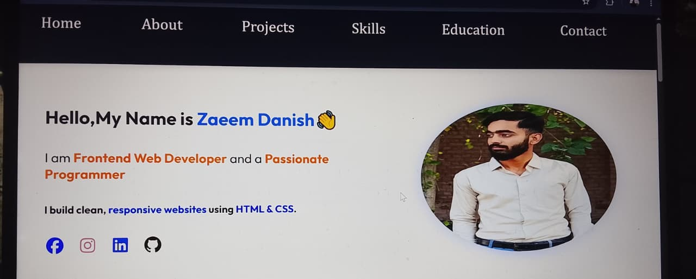

# 🌐 Personal Portfolio Website

A responsive personal portfolio website built with HTML and CSS to showcase my skills, projects, education, and contact information.

## 🚀 Features

- Responsive design
- Modern and clean UI
- About Me section
- Projects showcase
- Skills section
- Education section
- Social media links
- Contact section

## 🛠️ Technologies Used

- HTML5
- CSS3
- Flexbox
- CSS Grid

## 📂 Projects Included

- 📚 Java Library Management System
- 🎮 Java Quiz Game
- 📝 Responsive Blog Card

## 📸 Preview

## 🌍 Live Demo

https://zaeemdanish007-hub.github.io/portfolio-website/

## 👨‍💻 Author

**Zaeem Danish**

Frontend Web Developer | BS Software Engineering Student

- GitHub: https://github.com/settings/profile
- LinkedIn: www.linkedin.com/in/zaeem-danish-920a01372

---

⭐ If you like this project, don't forget to star the repository!
